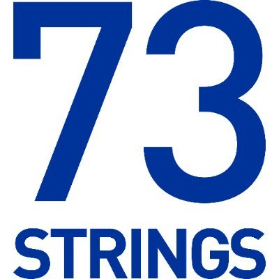

<!-- Text can be **bold**, _italic_, or ~~strikethrough~~. -->

<!-- [Linkedin Page](https://www.linkedin.com/in/ayham-olleik-9aaa97188/). -->

**[Personal](#personal) | [Work Expericence](#work-experience) | [Education](#education) | [Course & Projects](#courses-and-projects) | [Contact](#contact)**

* * *

```
Hello!
In this page I present to you my CV and personal experience
```

# Personal
Interested in Computer Vision, Deep Learning, Natural Language Processing and Applied Research.

# Work Experience

## Machine Learning Engineer
Working on the development of a complete **Natural Language Processing (NLP)** pipeline for Financial Information Extraction from various input formats such as pdf documents.

**Company:** [73Strings](https://www.73strings.com/)\
**Location:** Paris, France\
**Date:** Oct. 2022 - Present

## Research & Machine Learning Intern
At 73Strings, I have completed a six months internship working mainly in **NLP** for Financial Information Extraction.

**Company:** [73Strings](https://www.73strings.com/)\
**Location:** Paris, France\
**Date:** Apr. 2022 - Sept. 2022
<!--  -->

## Deep Learning and Computer Vision Intern
Worked from scratch on the Research & Development of a complete **Synthetic Data Generation** pipeline for the purpose of **Computer Vision** training tasks. The pipeline consists of an **Automated Rendering** component using user input **3D Models** and various custom HDRI backgrounds. Additionally, the rendering runs on the [Blender](https://www.blender.org/) Engine and proper experiments were ran on training SOTA Computer Vision models (Yolo, Dssd, Rcnn)

**Company:** [Groupe Renault](https://www.renaultgroup.com/)\
**Location:** Paris, France\
**Date:** Apr. 2021 - Sept. 2021

## Transverse Project
In collaboration between [Ecole Polytechnique](https://www.polytechnique.edu/) & [Clipdrop](https://clipdrop.co/) I have worked on an Image Relighting project using **GANs** and concepts from **3D reconstruction** of normal, depth and specular maps. The project aims at **relighting** the image using new backgrounds while taking into consideraton the 3D information of the original un-presented scene. I worked on training **Deep Learning** models on **Big Datasets** on **[AWS](https://aws.amazon.com/)**.

**Instituation:** [Ecole Polytechnique](https://www.polytechnique.edu/) & [Clipdrop](https://clipdrop.co/)\
**Location:** Paris, France\
**Date:** Oct. 2021 - Apr. 2022

## Software Engineer
Worked on the development of new features for the main app developed by Pocketcampus. I was mainly working with **Java** and **MySQL**.

**Instituation:** [Pocketcampus](https://pocketcampus.org/v2/home-en)\
**Location:** Beirut, Lebanon\
**Date:** Oct. 2019 - Jun. 2020

## Research Assitant
At the American Univerity of Beirut, I collaborated and wrote code with a research team working on Algorithmic Fairness for online job market ranking algorithms.

**Instituation:** [American Univerity of Beirut](https://www.aub.edu/)\
**Location:** Beirut, Lebanon\
**Date:** Jan. 2020 - Jun. 2020


## Software Engineer Intern
Worked on a project aiming at replacing campus ID cards (e-purse, access control) with a smartphone app that authenticates against a TWN4 Canon reader device over Bluetooth Low Energy (BLE) technology. The project included a research phase to determine the secured protocol that will be used between the app and the TWN4 reader and finally an implementation phase for a fully working proof of concept demo on Android devices.

**Instituation:** [Pocketcampus](https://pocketcampus.org/v2/home-en)\
**Location:** Lausanne, Switzerland\
**Date:** Jun. 2019 - Sept. 2019

# Education

## École Polytechnique
**Degree:** Masters' in **Artificial Intelligence & Advanced Visual Computing** (Graduated with Distinction)\
**Location:** Paris, France\
**Date:** Sept. 2020 - Sept. 2022\
**Website:** [l'X](https://www.polytechnique.edu/)

## American University of Beirut
**Degree:** Bachelor of **Engineering in Computer and Communications** (Graduated with Distinction)\
**Location:** Paris, France\
**Date:** Jun. 2016 - Jun. 2020\
**Website:** [AUB](https://www.aub.edu/)

# Courses and Projects

# Contact

**Email**: ayhamolk@gmail.com